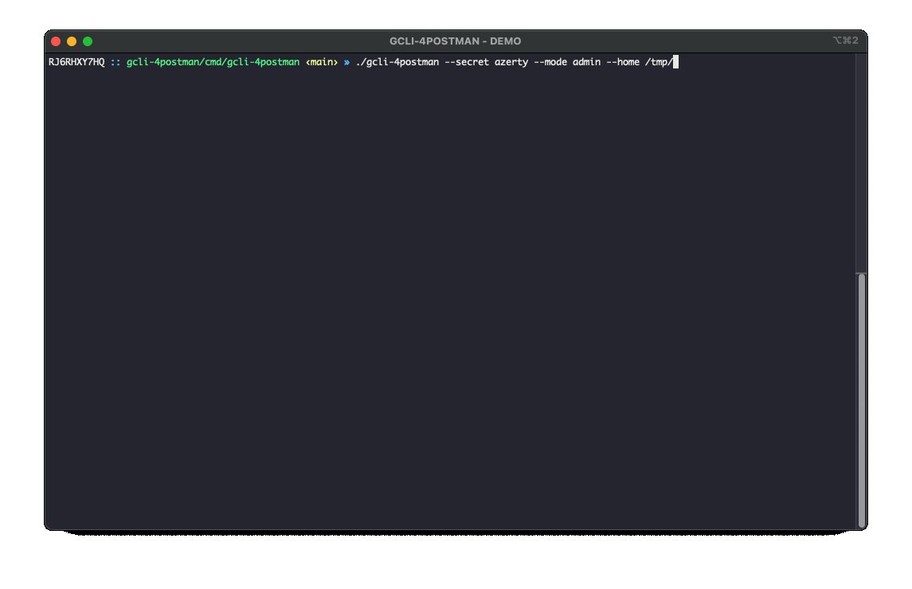

# `CLI-4Postman`

[](https://goreportcard.com/report/github.com/joakim-ribier/gcli-4postman)

[](https://pkg.go.dev/github.com/joakim-ribier/gcli-4postman)


#### `CLI-4Postman` is a GO command line interface (CLI) for Postman based on [go-prompt](https://github.com/c-bata/go-prompt) awesome library.

[Usage](#usage) - [CMD](#cmd) - [Releases](#releases) - [How to Install](#how-to-install) - [Thanks](#thanks) - [License](#license)

## Usage

```
$ ./gcli-4postman --secret {your-secret} --mode admin --home /home/{user}/data/gcli-4postman
```



| Option | | Description |
| --- | --- | ---
| --home | /home/{user}/data/cli-4postman | To define the root folder or directly by adding a new environment variable `$GCLI_4POSTMAN_HOME`.
| --log | /path/app.log | To choose the path of the log file (by default `./gcli-4postman.log`).
| --mode | admin | To select the CLI execution mode (`user`by default). The `admin` mode is used to build the `README.md` and enable/disable the `secure mode`.
| --secret | {your-secret} | To encrypt (or not) data on the disk. By default Postman does not encrypt data during export (even environment passwords...).

To get started quickly, export collections from a Postman account and add them on the `$GCLI_4POSTMAN_HOME` folder:

  * $GCLI_4POSTMAN_HOME
    * Personal (workspace)
      * github.collection.json (collection)
      * postman.collection.json (collection)
      * localhost.env.json (environment)
      * prod.env.json ...
    * {My Company} (new workspace)
      * ...

#how-to-use#
## CMD

The `CLI` is handled by a `prompt completer` which tries to get the correct suggestions.
To optimize the list of suggestions from the prompt completer, it is possible to combine `&&` and `||` operators.
* `{a single value}` only matches with the left side of the suggestion `{Suggest.Text}`.
* `{value}&&{value}` matches the left value with the `{Suggest.Text}` `AND` the right side with the `{Suggest.Description}`.
* `{value}||{value}` matches the left value with the `{Suggest.Text}` `OR` the right side with the `{Suggest.Description}`.

| Command |  | Option | Description |
| --- | --- | --- | --- |
| load | :l |  | Load a collection - `Postman API HTTP requests format` - from the local disk.<br/>`# :l my-collection` |
| env | :e |  | Select the collection execution environment.<br/>`# :e localhost` |
| http | :h |  | Execute a request from the collection - `!! BE CAREFUL TO THE ENVIRONMENT !!`<br/>`# :h -m GET -u GET:users --pretty` |
 |  |  |  `-m`  |  - filter requests by method (GET, POST, ...)  | 
 |  |  |  `-u`  |  - find a request to execute  | 
 |  |  |  `-history`  |  - find a history request<br/>`# :h -history GET:users --pretty`  | 
 |  |  |  `-history --reset`  |  - reset the collection history requests  | 
 |  |  |  `--search {pattern}`  |  - XPath query to extract data from the response  | 
 |  |  |  `--pretty`  |  - display a beautiful HTTP json response  | 
| display | :d |  | Display API requests of the current loaded collection.<br/>`# :d --search users` |
 |  |  |  `--search {pattern}`  |  - API requests full-text search  | 
| postman | :p |  | Connexion to a `Postman` account to sync the workspaces on the local disk.<br/>`# :p --apiKey {KEY} -sync {workspace}` |
 |  |  |  `--apiKey`  |  - API keys settings  | 
 |  |  |  `-workspace`  |  - display the remote workspaces linked to the {API_KEY}  | 
 |  |  |  `-sync {workspace Id/Name}`  |  - sync one of the workspaces locally  | 
| settings | :s |  | Available settings (or actions) on `CLI-4Postman`<br/>`# :s -secure-mode enable --secret {secret}` |
 |  |  |  `-update-readme`  |  - update the README from help documentation `// --mode admin`  | 
 |  |  |  `-secure-mode enable`  |  - enable secure mode by adding (or update) a new secret `--secret {secret}` `// --mode admin`  | 
 |  |  |  `-secure-mode disable`  |  - disable secure mode `!! NOT RECOMMENDED !!` `// --mode admin`  | 
| exit | :q |  | Exit the application.<br/>`# :q` |


 `--search {pattern}`  is a 'XPath query' (`//*/status[text()='ERROR']`) format to filter the response, 
                       go to `https://github.com/antchfx/jsonquery` to see all possibilities.           
#how-to-use#

The `how-to-use` part is directly generated from the application in `ADMIN` mode.
```
$ ./gcli-4postman --mode admin
...
$ {collection} >> {no-env} # settings -update-readme
>> Would you like to update README (Yes/No) : Yes
> README.md updated!
```

## Releases

### v0.1.x

* [] Implement tests...
* [] Refactor the collection view (replace the `tree` by a `table`)
* [] Implement the environment view
* [] Improve search mode in the response API request
* [] Improve the implementation using the [go-utils](https://github.com/joakim-ribier/go-utils) library
* [] Refactor prompt action to seperate execution code in its own prompt executor
* [] ...

### v0.1.0

* [x] Implement the first **CLI-4Postman** code base
  * [x] Import collections and environments from Postman account (`API_KEY`)
  * [x] Search and execute an API request on a specific environment
  * [x] Display a collection
  * [x] Historise API requests
  * [x] Historise global commands
  * [x] Encrypt / Decrypt data on disk (`--secret my-secret`)
  * [x] Update `README.md` directly from a `prompt-action`
  * [x] Help
* [x] Implement the [go-utils](https://github.com/joakim-ribier/go-utils) library

## How To Install

```
go install -v github.com/joakim-ribier/gcli-4postman/cmd/gcli-4postman@latest
```

## Thanks

* [Library for building powerful interactive prompts](https://github.com/c-bata/go-prompt)
* [Utilities to prettify console output of tables, lists...](https://github.com/jedib0t/go-pretty)
* [Go package that provides fast methods for formatting JSON ](https://github.com/tidwall/pretty)
* [Library that provides utilities functions to manipulate slices type, json serialization and http calls](https://github.com/joakim-ribier/go-utils)

## License

This software is licensed under the MIT license, see [License](https://github.com/joakim-ribier/go-utils/blob/main/LICENSE) for more information.